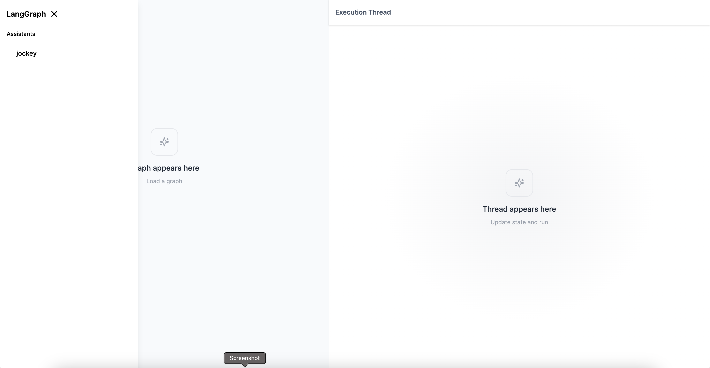
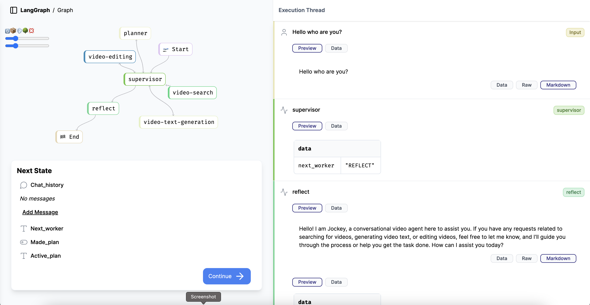

# Jockey

Jockey is a conversational video agent built on top of the [Twelve Labs APIs](https://docs.twelvelabs.io/docs/introduction) and [LangGraph](https://python.langchain.com/v0.1/docs/langgraph/).

## Description

**ATTENTION**: Jockey is in alpha development and may break or behave unexpectedly!

Jockey combines the capabilities of existing Large Language Models (LLMs) with the [Twelve Labs APIs](https://docs.twelvelabs.io/docs/introduction) using [LangGraph](https://python.langchain.com/v0.1/docs/langgraph/). This allows workloads to be allocated to the appropriate foundation models for handling complex video workflows. LLMs are used to logically plan execution steps and interact with users, while video-related tasks are passed to [Twelve Labs APIs](https://docs.twelvelabs.io/docs/introduction), powered by video-language models (VLMs), to work with video natively, without the need for intermediary representations like pre-generated captions.

## Quickstart

### Dependencies

- [FFMPEG](https://ffmpeg.org/): Must have `ffmpeg` accessible in `$PATH` for the Video Editing worker.
- [Docker](https://www.docker.com/): Required for running the Jockey API server.
- [Docker Compose](https://docs.docker.com/compose/): Required for running the Jockey API server.
- Library Requirements: [requirements.txt](../requirements.txt)
- Twelve Labs API Key: [Twelve Labs Dashboard](https://dashboard.twelvelabs.io/)
- LLM Provider API Key

### Deploying in the Terminal

This is an easy and lightweight way to run an instance of Jockey in your terminal. Great for quick testing or validation.

1. Modify [jockey_default_server.py](jockey_default_server.py) with your desired configuration.
2. Run the following command:
   
   ```bash
   python3 jockey_dev_example.py local
   ```

### Deploying with the LangGraph API Server

This approach is more suitable for building and testing end-to-end user applications although it is a bit more involved on the configuration side.

1. Modify [langgraph.json](langgraph.json) so that it points to your `.env` file and includes any other dependencies you may need.
2. Modify [compose.yaml](compose.yaml) if needed as well.
3. Run the following command:

    ```bash
    langgraph up -c langgraph.json -d compose.yaml
    ```
4. Open [LangGraph Debugger](http://localhost:8124/) in your browser to ensure the LangGraph API server is up and reachable.
5. Visit: [LangGraph Examples](https://github.com/langchain-ai/langgraph-example) for more detailed information on integrating into a user application. You can also check out: [client.ipynb](client.ipynb) for a basic example in a Jupyter notebook.
6. You can use the [LangGraph Debugger](http://localhost:8124/) to step into the Jockey instance and debug end-to-end including adding breakpoints to examine and validate the graph state for any given input.

## Jockey Agent Architecture


Jockey consists of three main parts.

1. **Supervisor**: This is the main agent that is responsible for node routing.
2. **Planner**: The primary purpose of the planner is to created step-by-step plans for complex user requests to to adjust/replan when things don't go as expected.
3. **Workers**: The worker nodes consist of two components.
   1. **Instructor**: The goal of the instructor is to generate exact and complete task instructions for a single worker based of the plan created by the Planner.
   2. **Actual Workers**: The actual workers are agents that ingest the instructions from the instructor and execute them using the tools they have available.

## Customizing Jockey

Jockey comes with a core set of workers for powering a conversational video agent. However, video-related use cases are diverse and complex, and the vanilla core workers may not be adequate for your needs. There are two main ways to customize Jockey that are explored below.

### Prompt as a Feature

This is the most lightweight way to customize Jockey. Use this approach when the agent's functionality or vanilla core workers are sufficient, but the planning capabilities of the LLM are not robust enough for consistent performance across various inputs.

To apply this customization, modify some or all of the [planner.md](./prompts/planner.md) prompt with more targeted and specific instructions. This approach works best for less open-ended use cases that involve minimal dynamic planning.

### Extending or Modifying Jockey

For more complex use cases, the out-of-the-box capabilities of the agent or vanilla core workers may be insufficient. In these instances, consider extending or modifying Jockey in the following ways:

#### Modifying Prompts

This is similar to the [Prompt as a Feature](#prompt-as-a-feature) approach but may require heavily modifying the [planner.md](./prompts/planner.md) and [supervisor.md](./prompts/supervisor.md) prompts.

#### Extending or Modifying State

Given the complex nature of video workflows, the default state that Jockey uses may be inadequate for your use case. Each node in the underlying StateGraph has full access to the JockeyState, allowing you to add or modify state variables to track complex state information that isn't easily handled by LLMs via conversation history. This can help ensure cohesive planning and correct worker selection.

Example:

```python
# Default JockeyState
class JockeyState(TypedDict):
    """Used to track the state between nodes in the graph."""
    chat_history: Annotated[Sequence[BaseMessage], add_messages]
    next_worker: str
    made_plan: bool
    active_plan: str
```

To handle multiple sequences of video that could be rendered, extend JockeyState:

```python
class Clip(BaseModel):
    """Define what constitutes a clip in the context of the video-editing worker."""
    index_id: str = Field(description="A UUID for the index a video belongs to. This is different from the video_id.")
    video_id: str = Field(description="A UUID for the video a clip belongs to.")
    start: float = Field(description="The start time of the clip in seconds.")
    end: float = Field(description="The end time of the clip in seconds.")

class Sequence(BaseModel):
    """Represents a single sequence of renderable video and its constituents."""
    clips: List[Clip]
    sequence_name: str

# Extended JockeyState
class JockeyState(TypedDict):
    """Used to track the state between nodes in the graph."""
    chat_history: Annotated[Sequence[BaseMessage], add_messages]
    next_worker: str
    made_plan: bool
    active_plan: str
    sequences: Dict[Sequence]
```

This allows you to manage multiple versions of a sequence that can be selectively rendered or easily modified.

#### Adding or Modifying Workers

If the first two customization options aren't sufficient, you can add or modify existing workers:

- **Modifying an Existing Worker**: Add custom logic or tools to an existing worker. You may also need to refine the appropriate prompt for the worker.
- **Adding a New Worker**: If none of the existing workers provide the needed capabilities, you can create a new worker. Use the [Stirrup](./stirrups/stirrup.py) class to define your custom worker. Modify [jockey_graph.py](jockey_graph.py) to integrate the new worker into Jockey. Update the appropriate [prompts](./prompts/) to ensure Jockey correctly uses the new worker(s).

By following these guidelines, you can customize Jockey to better fit your specific video-related use cases.